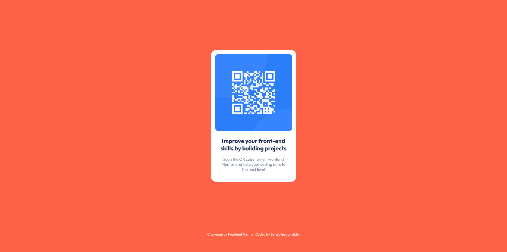

# Frontend Mentor - QR code component solution

This is a solution to the [QR code component challenge on Frontend Mentor](https://www.frontendmentor.io/challenges/qr-code-component-iux_sIO_H). Frontend Mentor challenges help you improve your coding skills by building realistic projects. 

## Table of contents

- [Overview](#overview)
  - [Screenshot](#screenshot)
  - [Links](#links)
- [My process](#my-process)
  - [Built with](#built-with)
  - [What I learned](#what-i-learned)
  - [Useful resources](#useful-resources)
- [Author](#author)

## Overview

### Screenshot

### Links

- Solution URL: [Add solution URL here](https://your-solution-url.com)
- Live Site URL: [sergioinsa.github.io/QRcodeComponent/](https://sergioinsa.github.io/QRcodeComponent/)

## My process

### Built with

- Semantic HTML5 markup
- CSS custom properties

### What I learned

Mainly it helped me to meet the basic features of CSS and the Semantics of HTML. A warm challenge to keep up the practice.

### Useful resources

If you are new and not so new, I would recommend you check the [MDN Docs site](https://developer.mozilla.org/es/)

## Author

- GitHub Profile - https://github.com/sergioinsa
- Frontend Mentor - [@sergioinsa](https://www.frontendmentor.io/profile/sergioinsa)
